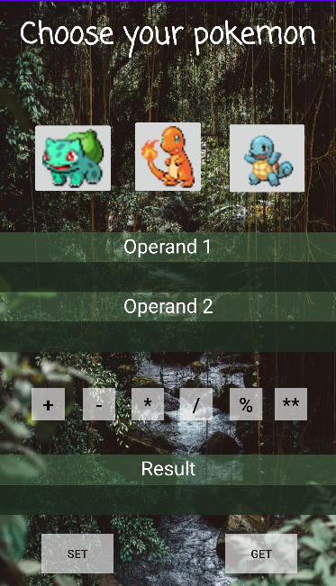
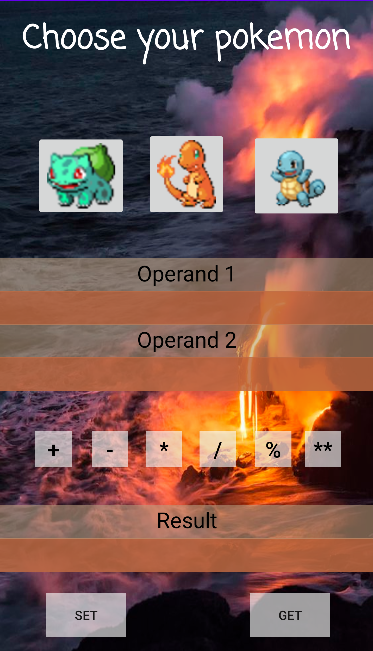
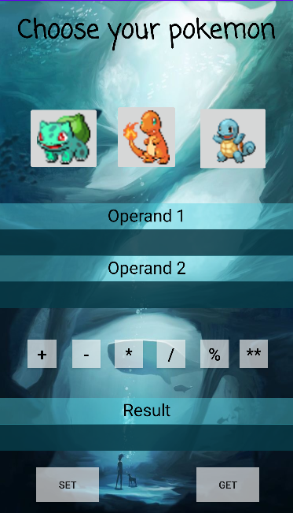

[![LinkedIn][linkedin-shield]][linkedin-url]
[![GitHub][github-shield]][github-url]
[![itch.io][itch-shield]][itch-url]
[![Instagram][instagram-shield]][instagram-url]
[![Youtube][youtube-shield]][youtube-url]
[![ArtStation][artstation-shield]][artstation-url]

<!-- PROJECT LOGO -->
 

  

<h3 align="center">Thematic Calculator</h3>

  

    This tutorial was aimed to develop a simple calculator with an interface adjustable to any screen with content related to a theme.
     
     
    >>
    <a href="https://github.com/github_username/repo_name/youtubevideo">View Demo</a>
    <<
  

<!-- ABOUT THE PROJECT -->
## About The Project

This work was aimed to introduce the application development environment for Android devices. The project introduces the anatomy of an Android program. From the application
“Hello World” a new application with a more elaborate user interface is built. The main idea is to make a simple calculator with an interface adjustable to any screen with content
related to a theme.

(<a href="#top">back to top</a>)

### Built With

* [Kotlin](https://kotlinlang.org/)
* [XML](https://developer.mozilla.org/en-US/docs/Web/XML/XML_introduction)
* [Android Studio](https://developer.android.com/studio)

(<a href="#top">back to top</a>)

<!-- CONTACT -->
## Contact

Email - beatrizsa1906@gmail.com

Portfolio - Still in Development

Itch.io - [https://barrythecoolbee.itch.io/](https://barrythecoolbee.itch.io/)

LinkedIn - [https://www.linkedin.com/in/beatriz-s%C3%A1-857a64222/](https://www.linkedin.com/in/beatriz-s%C3%A1-857a64222/)

Instagram - [https://www.instagram.com/barrythecoolbee/](https://www.instagram.com/barrythecoolbee/)

Youtube - [https://www.youtube.com/channel/UCuzo8NbNm7MCut_lDQ7WNvw](https://www.youtube.com/channel/UCuzo8NbNm7MCut_lDQ7WNvw)

ArtStation - [https://www.artstation.com/barrythecoolbee](https://www.artstation.com/barrythecoolbee)

Project Link: [https://github.com/barrythecoolbee/ProsperityShelterApp](https://github.com/barrythecoolbee/PokemonCalculatorApp)

(<a href="#top">back to top</a>)

[linkedin-shield]: https://img.shields.io/badge/-LinkedIn-black.svg?style=for-the-badge&logo=linkedin&colorB=555
[linkedin-url]: https://www.linkedin.com/in/beatriz-s%C3%A1-857a64222/
[github-shield]: https://img.shields.io/badge/-GitHub-black.svg?style=for-the-badge&logo=github&colorB=555
[github-url]: https://github.com/barrythecoolbee
[itch-shield]: https://img.shields.io/badge/-itch.io-black.svg?style=for-the-badge&logo=itch.io&colorB=555
[itch-url]: https://barrythecoolbee.itch.io/
[instagram-shield]: https://img.shields.io/badge/-Instagram-black.svg?style=for-the-badge&logo=instagram&colorB=555
[instagram-url]: https://www.instagram.com/barrythecoolbee/
[youtube-shield]: https://img.shields.io/badge/-Youtube-black.svg?style=for-the-badge&logo=youtube&colorB=555
[youtube-url]: https://www.youtube.com/channel/UCuzo8NbNm7MCut_lDQ7WNvw
[artstation-shield]: https://img.shields.io/badge/-ArtStation-black.svg?style=for-the-badge&logo=artstation&colorB=555
[artstation-url]: https://www.artstation.com/barrythecoolbee
